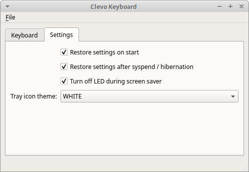

# Clevo Keyboard GUI

Application allows convenient control of Clevo keyboard LED backlight. In addition it 
restores lights settings after startup and returning from suspend state.

## Features
- system tray icon
- persisting application settings
- restoring LED seetings after suspension / hibernation
- detection of LED settings changed externally

## Screens

## Requirements
- *Clevo* based device
- *PyQt5*
- *watchdog*
- *tuxedo-keyboard* driver

For more info about installing *tuxedo-keyboard* driver visit:
https://github.com/tuxedocomputers/tuxedo-keyboard

## Running application

To run application try one of:
- run *src/clevokbdctl*
- run *src/clevokeyboardcontrol/main.py* 
- execute *cd src; python3 -m clevokeyboardcontrol*

Application can be run in profiler mode passing *--profile* as command line parameter. 

## Running tests

To run tests execute *src/runtests.py*. It can be run with code profiling 
and code coverage options.

In addition there is demo application not requiring installed drivers. It 
can be run by *testclevokeyboardcontrol/gui/main_window_example.py*.

## Modules
- clevokeyboardcontrol.main -- entry point for the application
- testclevokeyboardcontrol -- unit tests for the application

## Examples of use of not obvious Python mechanisms
- properly killing (Ctrl+C) PyQt (*sigint.py*)
- loading of UI files and inheriting from it
- code profiling (*cProfile*)
- code coverage (*coverage*)

## ToDo
- add support for old *clevo-wmi* driver
- add keyboard sleep option

## References
- https://github.com/tuxedocomputers/tuxedo-keyboard

